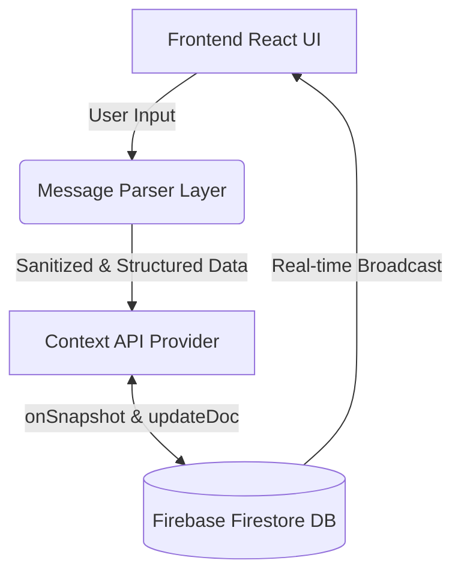

# 🚀 SyncFlow – Real-Time Team Coordination System

> “Antigravity enhances team coordination by converting communication into structured tasks and providing real-time visibility across workflows.”

## 🧩 Problem Statement

Teams today rely on multiple disconnected tools for communication and task tracking, leading to poor visibility of who is doing what, manual updates and status chasing, and missed deadlines due to a lack of real-time coordination. 

## 💡 Solution Overview

**SyncFlow** is a lightweight coordination layer that seamlessly converts team communication into actionable tasks. By providing a live, Kanban-style board and an instant team visibility panel, SyncFlow bridges the gap between talking about work and tracking the work.

## ✨ Features

- **💬 Message-to-Task Conversion**: Type natural language updates (e.g., "I will fix the login bug by today") to instantly generate structured tasks assigned to the correct owner.
- **🧾 Smart Task Board**: A fluid, Kanban-style board to track To-Do, In Progress, and Done items.
- **👀 Live Team Visibility Panel**: Real-time insights into team activity, displaying active tasks per member to identify workload bottlenecks instantly.
- **🚨 Blocker Highlights**: Mark tasks as "Blocked" to visually demand attention from the entire team.
- **☁️ Real-time Synchronization**: Powered by Firebase Firestore for instant updates across all clients.

## 🛠️ Tech Stack

- **Frontend**: React.js (via Vite)
- **Styling**: Vanilla CSS (Premium dark mode, Glassmorphism, Micro-animations)
- **Backend/Database**: Firebase Firestore (Real-time NoSQL DB)
- **Security**: DOMPurify for XSS sanitization, `.env` config for secrets.
- **Testing**: Vitest + React Testing Library

## 🏗️ Architecture



## 🚀 Getting Started

1. **Install Dependencies:**
   ```bash
   npm install
   ```

2. **Environment Variables:**
   Rename `.env.template` to `.env` and fill in your Firebase Configuration credentials.

3. **Run Development Server:**
   ```bash
   npm run dev
   ```

4. **Run Tests:**
   ```bash
   npm run test
   ```

## 🔮 Future Scope

- **AI Integration**: Enhance the message parser with an LLM for complex context understanding.
- **Slack/Discord Webhooks**: Automatically push blocker notifications to team chat.
- **Advanced Analytics**: Generate sprint velocity reports and bottleneck identification.

---
*Built with ❤️ and optimization in mind.*
